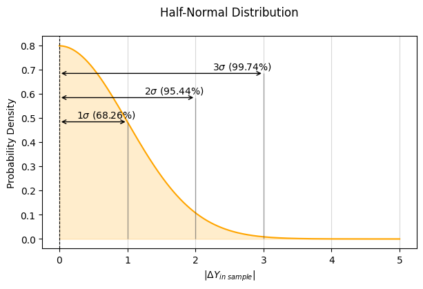

# 絕對誤差監控 Absolute Error Monitoring   

           

### 前言  
對於機器學習的落地應用，當一個 ML 模型訓練完成且部署上線後，模型在未知數據的預測表現與穩定性，將會直接關係到商業或製造管理的決策成效。

在迴歸問題中，模型單點預測誤差的監控，有下列三個概念 :  
- 在訓練 ML 模型時，若模型的解釋能力高，則，單點回測殘差(Residual)理應會近似或符合常態分布。  
- 在監控 ML 模型時，單點預測絕對誤差的監控上界，可用訓練模型時的回測 MAE，作為設定監控上界的基準。  
- 針對單點預測絕對誤差的監控，當以回測 MAE 作為監控界限的設定基準，其統計的涵義，相當於回測的單點絕對誤差分布的 0.8 倍標準差。    

      

### ML 模型單點預測誤差的監控
- 概念說明與實例 Python 程式碼     :point_left:      
- [實務札記]()  
- [ML 單點預測誤差監控 - 隨手指南](https://github.com/YenLinWu/Daily_Work_of_Data_Science/blob/Dev/Absolute_Error_Monitoring/)  
      
 

Back to [資料科學的日常研究議題](https://github.com/YenLinWu/Daily_Work_of_Data_Science/blob/main/README.md#%E8%B3%87%E6%96%99%E7%A7%91%E5%AD%B8%E7%9A%84%E6%97%A5%E5%B8%B8)
