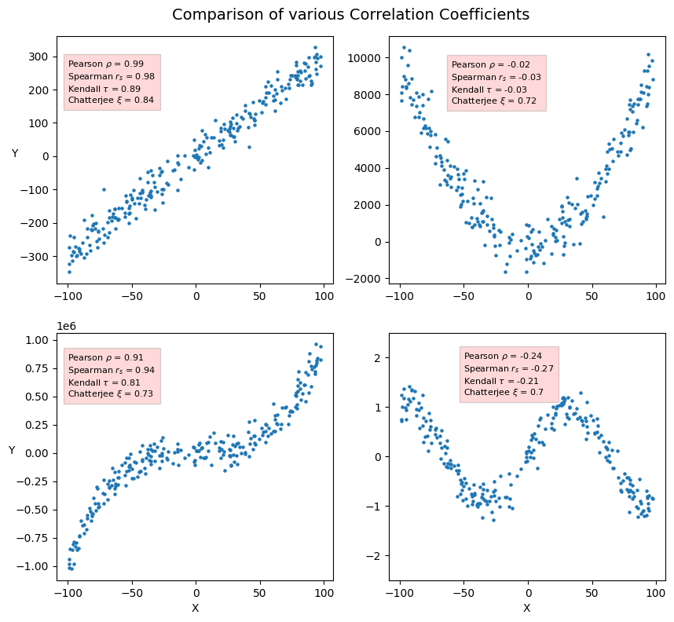

# 關聯性與相關性 Association and Correlation   

       

### 前言  
在資料分析的過程中，探索變數之間的關聯性/相關性，除能有助於我們理解數據中潛在或顯著的關係外，也能輔助我們在訓練機器學習模型時，尋找到具有影響力且重要的特徵變數，以提升模型的預測能力與解釋能力。
下列我們將針對不同的變數型態，介紹各自適用的統計方法，包括 : Contingency Coefficient、Cramer’s V、Pearson 相關係數、Spearman 與 Kendall 等級相關係數等，以讓大家能更精確地選用合適的統計工具，來衡量變數之間的關係。除此之外，最後還將介紹一個新的係數指標 : Chatterjee 相關係數  ξ ，它可用來評估兩變數之間是否存在某個函數的對應關係。

      

### 統計方法的介紹與 Python 實作程式碼     :point_left:   
    
Back to [資料科學的日常研究議題](https://github.com/YenLinWu/Daily_Work_of_Data_Science/blob/main/README.md#%E8%B3%87%E6%96%99%E7%A7%91%E5%AD%B8%E7%9A%84%E6%97%A5%E5%B8%B8)
