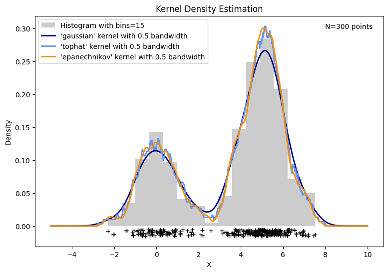

# 核密度估計 Kernel Density Estimation, KDE

         

### 前言  
在資料科學領域中，觀察和理解數據的分布，是一開始解析數據的重要環節之一，而，KDE 是一個極具價值且實用的方法，其不僅能平滑數據捕捉樣本的潛在型態，且還能估算出樣本的機率密度函數，提供更多元且詳盡的數據細節。

      

### KDE 的介紹與 Python 實作程式碼     :point_left:  

### 參考文獻   
- Andrey Akinshin. October 13, 2020. The importance of kernel density estimation bandwidth. [https://aakinshin.net/posts/kde-bw/](https://aakinshin.net/posts/kde-bw/).
- Jaroslaw Drapala. Aug 16, 2023. Kernel Density Estimator explained step by step. [https://towardsdatascience.com/kernel-density-estimation-explained-step-by-step-7cc5b5bc4517](https://towardsdatascience.com/kernel-density-estimation-explained-step-by-step-7cc5b5bc4517).

     

Back to [資料科學的日常研究議題](https://github.com/YenLinWu/Daily_Work_of_Data_Science/blob/main/README.md#%E8%B3%87%E6%96%99%E7%A7%91%E5%AD%B8%E7%9A%84%E6%97%A5%E5%B8%B8)
