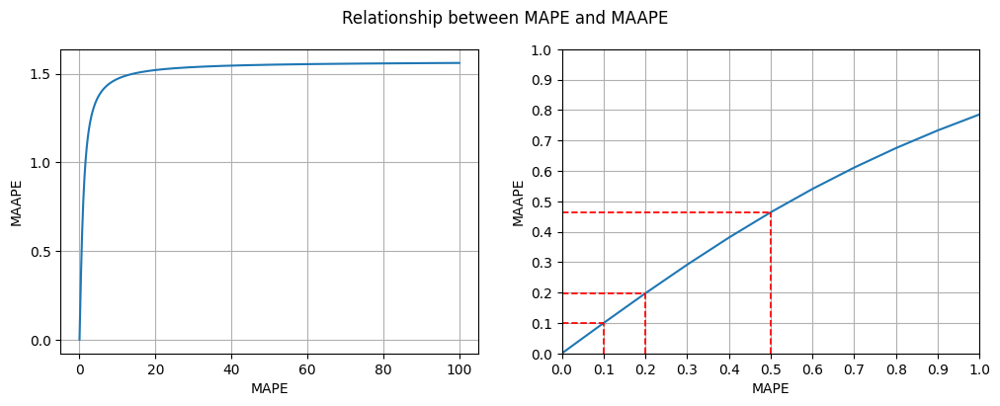

# 平均反正切絕對百分比誤差與平均絕對百分比誤差 MAAPE and MAPE   

      

### 前言  
有關機器學習迴歸模型的評估，平均絕對百分比誤差(Mean Absolute Percentage Error, MAPE)是一種常用的指標，因為，MAPE 易於理解和解釋，且可對不同模型進行比較。然而，當實際值為 0 或非常接近 0 時，MAPE 會有無法計算或無限大的問題，限制了 MAPE 在某些特殊情境中的應用。

當資料集中存在間歇性或少量的實際值為 0 時，為了克服 MAPE 的問題，我們可選擇另一個評估指標 : 平均反正切絕對百分比誤差(Mean Arctangent Absolute Percentage Error, MAAPE)，MAAPE 係將誤差視為角度而非比例，提供一個從 0 到 π/2 的有界度量範圍，為一個有效替代 MAPE 的評估指標。

      

### MAAPE 的介紹與 Python 範例程式碼     :point_left:   
    
### 參考文獻  
* [What are the shortcomings of the Mean Absolute Percentage Error (MAPE)?](https://stats.stackexchange.com/questions/299712/what-are-the-shortcomings-of-the-mean-absolute-percentage-error-mape/299713#299713) in [Stack Exchange](https://stats.stackexchange.com/).
* Sungil Kim, Heeyoung Kim, A new metric of absolute percentage error for intermittent demand forecasts, Volume 32, Issue 3, 2016, Pages 669-679, ISSN 0169-2070, [https://doi.org/10.1016/j.ijforecast.2015.12.003](https://www.sciencedirect.com/science/article/pii/S0169207016000121)

    

Back to [資料科學的日常研究議題](https://github.com/YenLinWu/Daily_Work_of_Data_Science/blob/main/README.md#%E8%B3%87%E6%96%99%E7%A7%91%E5%AD%B8%E7%9A%84%E6%97%A5%E5%B8%B8)
