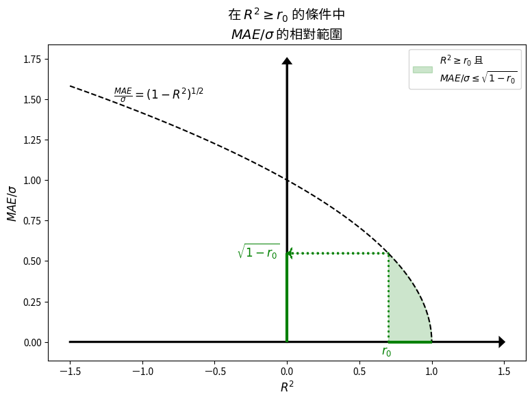

# 機器學習模型指標的關係 - 迴歸問題 

       

### 目的  
針對機器學習模型的解釋能力指標 R2 與預測能力指標 MAE、RMSE，探討兩能力指標的相對應大小關係，以協助大家在訂定指標的目標時，能有明確的概念且訂定出更具體適用的指標目標。

### 指標間的關係
- MAE 小於等於 RMSE
- MAE/Sigma 小於等於 (1-R2)^(1/2)  
  關係推導與 Python 範例程式碼     :point_left:  
  

      

  
- 機器學習迴歸問題中，模型指標的目標訂定，建議步驟 :    
  Step 1: 決定解釋能力指標的下限目標  
  Step 2: 計算預測誤差 MAE/Sigma 的最大範圍  
  Step 3: 決定預測誤差 MAE/Sigma 的目標範圍  

      
Back to [資料科學的日常研究議題](https://github.com/YenLinWu/Daily_Work_of_Data_Science/blob/main/README.md#%E8%B3%87%E6%96%99%E7%A7%91%E5%AD%B8%E7%9A%84%E6%97%A5%E5%B8%B8)
