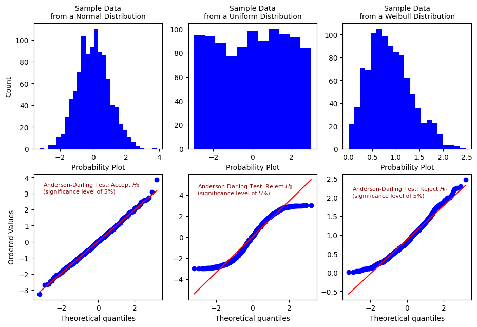
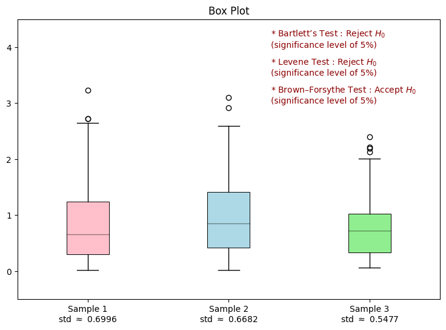

# 常態性與同質性檢定 Normality and Homogeneity Test    

       

### 前言  
對於許多的統計方法，常態性檢定(Normality Test)與變異數同質性檢定(Test for Homogeneity of Variance)係確認統計方法適用性的關鍵過程，不僅使我們能正確得套用統計方法，且確保分析結果的準確性。常見的檢定方法有:    
  * 常態性檢定:    
    Anderson-Darling Test、Shapiro-Wilk Test、Kolmogorov-Smirnov Test
  * 變異數同質性檢定:   
    Bartlett’s Test、Levene Test、Brown–Forsythe Test

      
      

### 檢定方法的介紹與 Python 實作程式碼     :point_left:   
    
Back to [資料科學的日常研究議題](https://github.com/YenLinWu/Daily_Work_of_Data_Science/blob/Dev/README.md#%E7%A0%94%E7%A9%B6%E8%AD%B0%E9%A1%8C)
