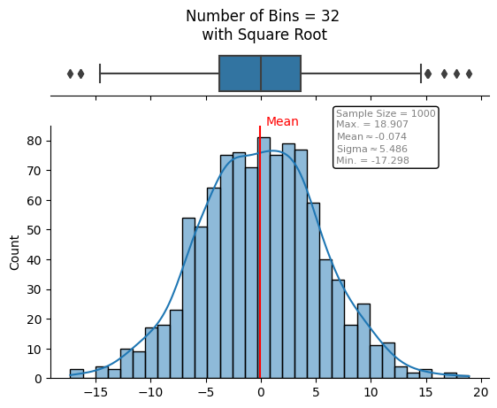
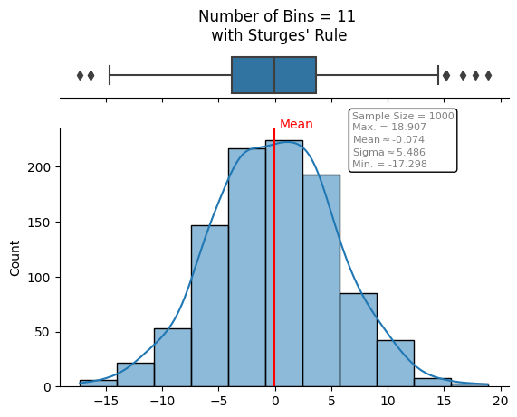
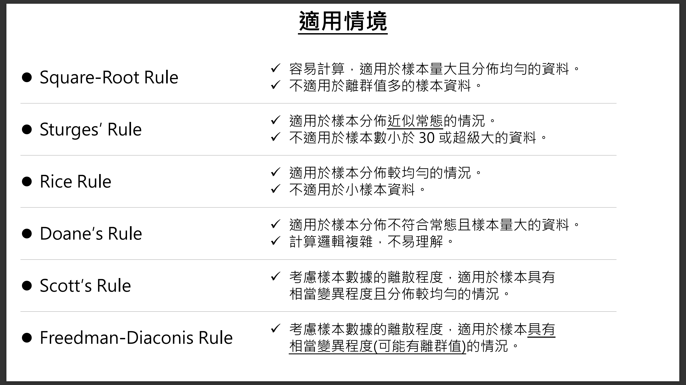

# 直方圖的分箱數與寬度 

       

### 研究目的  
直方圖(Histogram)是一種常用的資料視覺化圖表，它可呈現資料的分佈情況，然而，不同的分箱(Bin)數量(或寬度)會對直方圖的呈現有不同影響。為了讓直方圖更客觀地勾勒出資料的分佈情況，針對 6 種常見的分箱方法進行探討，分別為: Square-Root Rule、Sturges’ Rule、Rice Rule、Doane’s Rule、Scott's Rule、Freedman-Diaconis Rule。

      
      

### 研究內容與 Python 程式碼     :point_left:   

### 分箱的原則  
- 不存在最佳的分箱數，不同的分箱數展現了不同的數據特徵。  
- 分箱過寬可能掩蓋掉樣本分佈的重要細節；  
  分箱過窄易導致大量的噪音，而干擾分佈的重要資訊。  
- 當樣本資料量較少(/較稀疏)，建議使用較寬的分箱，以降低樣本抽樣隨機的噪音；  
  當樣本資料量較大(/較密集)，建議使用較窄的分箱，以提升估計的精度。

   
      
Back to [資料科學的日常研究議題](https://github.com/YenLinWu/Daily_Work_of_Data_Science/blob/Dev/README.md#%E7%A0%94%E7%A9%B6%E8%AD%B0%E9%A1%8C)
